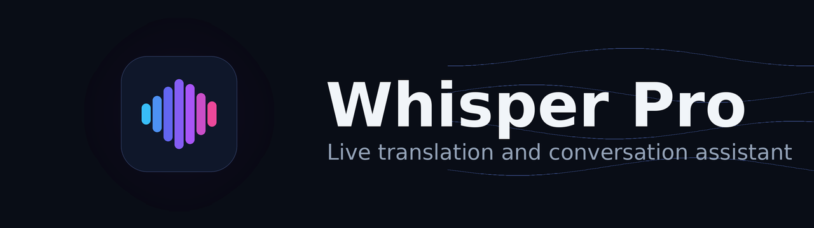
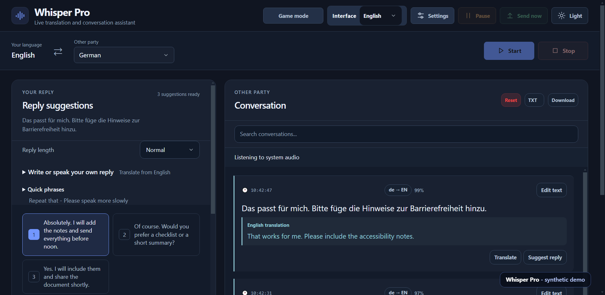
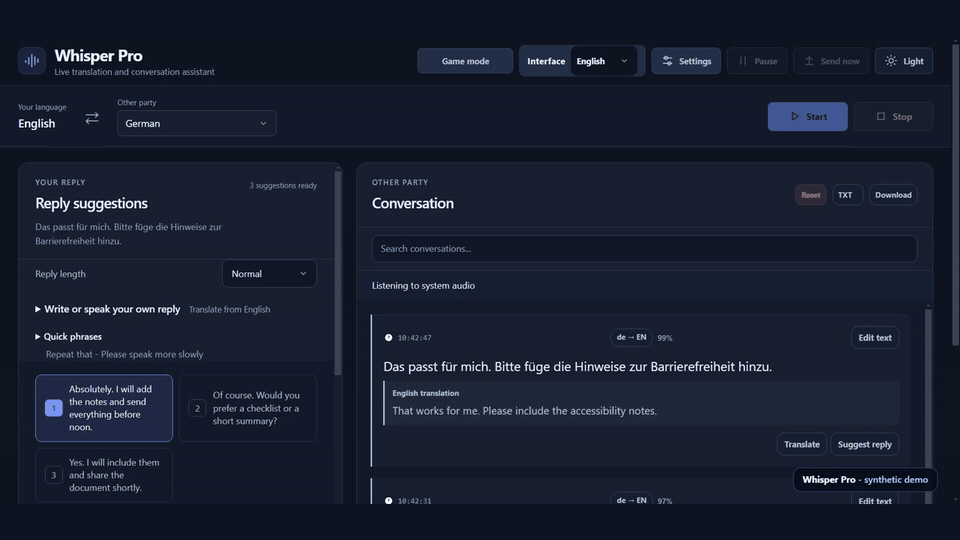

<div align="center">



**Hear it. Read it. Answer in any language.**

[](docs/INSTALLATION.md)
[](LICENSE)
[](https://github.com/dorukakindev/whisper-live-translator/actions/workflows/public-checks.yml)

[Installation](docs/INSTALLATION.md) · [Usage](docs/USAGE.md) · [Architecture](docs/ARCHITECTURE.md) · [Troubleshooting](docs/TROUBLESHOOTING.md) · [Privacy](docs/PRIVACY.md)

</div>

---

Whisper Pro is a Windows desktop assistant for live conversations across languages. It captures microphone or Windows system audio, transcribes speech locally with faster-whisper, optionally translates incoming speech, and generates reply suggestions with Turkish-friendly pronunciation guides you can read aloud.



The live workspace keeps the full conversation readable while reply suggestions stay ready beside it. Each reply includes its native wording, Turkish meaning, and a pronunciation line designed to be read aloud.



[Watch the short MP4 demo](docs/media/whisper-pro-demo.mp4) · [View reading mode at full resolution](docs/media/whisper-pro-reading-mode.png)

> The media above is rendered from the real Electron UI with synthetic conversation data. The interface starts in English; choose **Türkçe** from the **Interface** selector in the top header at any time.

> [!IMPORTANT]
> This project is under active development. Never commit API keys or private transcripts, and review the known limitations before important use.

## Highlights

- 🎙️ Live microphone and Windows system-audio transcription
- 🌐 Optional incoming-speech translation
- 💬 AI replies with native text, Turkish meaning, and Turkish-readable pronunciation
- ⚡ Live partial transcription, push-to-talk tools, quick phrases, search, and export
- 👥 Optional speaker diarization and a compact game overlay
- 🔒 Local-only backend by default (`127.0.0.1`)

## What you can do

| Feature | What it does | How to use it |
| --- | --- | --- |
| Live conversation | Captures a microphone or Windows system audio and turns speech into a readable conversation stream. | Open **Settings**, choose the source and language, then start listening. |
| On-demand translation | Lets you leave automatic translation off and translate only the lines you need. | Press **Translate** below any transcript. |
| Reply suggestions | Creates natural replies in the target language, with Turkish meaning and a Turkish-readable pronunciation line. | Press **Suggest reply** on an incoming line, then choose one of the reply cards. |
| Reading mode | Shows one pronunciation at a large, distraction-free size and can read the native sentence aloud. | Open **Reading mode** from a reply; use `1`–`4` to open visible choices and `Esc` to close. |
| Quick phrases and saved replies | Opens useful phrases immediately without an AI request and keeps reusable replies locally. | Choose a quick phrase or save a generated reply to your phrase collection. |
| Speak or type your own reply | Translates a response you compose yourself instead of relying on suggestions. | Expand **Write or say your own reply**, then type or use push-to-talk. |
| Conversation tools | Searches the visible session and full history, edits transcript text, creates a summary, and answers questions about the conversation. | Use the search and conversation tools around the transcript panel. |
| Export | Saves the conversation for later review. | Select `TXT` or `SRT`, then press **Download**. |
| Speaker diarization | Attempts to separate and rename different speakers. | Enable it in **Settings** and provide the optional Hugging Face access required by pyannote. |
| Game Mode | Opens a compact always-on-top translation overlay and applies a temporary, faster dialogue capture profile to system audio. | Press **Game Mode**, start system-audio listening normally, position the overlay, then lock it over the game. |

## Typical workflows

### Follow a live call or video

1. Choose **System audio** for a call, stream, or video; choose **Microphone** for nearby speech.
2. Select the expected spoken language, or automatic detection where appropriate.
3. Enable continuous translation only when you want every incoming line translated.
4. Start listening. A muted partial preview may appear first; the final transcript replaces it after the utterance is complete.
5. Search, correct, summarize, ask about, or export the resulting conversation when needed.

### Reply in a language you do not speak

1. Press **Suggest reply** below the relevant incoming sentence.
2. Pick a response by meaning and tone.
3. Read the Turkish-friendly pronunciation line aloud, or open **Reading mode** for a larger display.
4. Use **Listen** or **Listen slowly** to hear the native sentence. Save useful replies, and mark one as said so later suggestions can avoid repeating it.

### Translate only selected lines

Automatic translation is optional. Keep it disabled when you want a clean transcript, then press **Translate** below an individual line. Manual translation still works even when continuous incoming translation is off.

### Use Game Mode

Game Mode is intended for dialogue-heavy games played in windowed or borderless-windowed mode. It does not capture the screen, inject into a game, or start listening by itself.

1. Press **Game Mode** in the main header. This opens the overlay and enables a temporary system-audio profile tuned for shorter dialogue gaps.
2. Select **System audio**, enable translation, and press the normal start-listening control.
3. Drag and resize the overlay. Open **Appearance** to adjust font size, background opacity, and whether the original sentence is shown.
4. Press **Lock to game** or `Ctrl+Shift+L`. The overlay becomes click-through and keeps only the translation visible.
5. Use `Ctrl+Shift+O` to show or hide the overlay. Return to the main window to disable Game Mode.


Both Game Mode screenshots come from the real overlay renderer with offline synthetic dialogue and an English presentation layer.

Exclusive fullscreen and some anti-cheat systems can prevent desktop overlays from appearing. Borderless-windowed mode is recommended. Game Mode changes neither the selected model nor the normal microphone and push-to-talk settings; its temporary audio profile applies only to system-audio capture.

For every control and limitation, read the [complete usage guide](docs/USAGE.md).

## Requirements

Whisper Pro currently targets 64-bit Windows. Install Git, Node.js/npm, and a compatible 64-bit Python. You also need a microphone or loopback-capable audio device and storage for Python packages and downloaded models.

Choose Claude (Anthropic) or OpenAI for AI replies and pronunciation; both can also power translation. DeepL remains an optional translation-only provider, and pyannote uses a separate optional credential. CPU transcription is supported; a compatible NVIDIA GPU can improve speed substantially.

## Quick start

```powershell
git clone https://github.com/dorukakindev/whisper-live-translator.git
Set-Location whisper-live-translator
npm ci --no-audit --no-fund
py -3.12 -m venv .venv
.venv\Scripts\python.exe -m pip install --upgrade pip
.venv\Scripts\python.exe -m pip install -r requirements.txt
Copy-Item .env.example .env
notepad .env
npm start
```

## Configuration

| Variable | Required | Purpose |
| --- | --- | --- |
| `ANTHROPIC_API_KEY` | For Claude features | Claude replies, pronunciation, and translation |
| `ANTHROPIC_MODEL` | No | Claude translation model override |
| `ANTHROPIC_RESPONSE_MODEL` | No | Claude reply-suggestion model override |
| `OPENAI_API_KEY` | For OpenAI features | OpenAI replies, pronunciation, and translation |
| `OPENAI_MODEL` | No | Translation model override |
| `OPENAI_RESPONSE_MODEL` | No | Reply-suggestion model override |
| `DEEPL_API_KEY` | No | Optional DeepL translation |
| `HF_TOKEN` | No | Optional pyannote speaker diarization |
| `HOST` / `PORT` | No | Local backend bind address and port |

Keep `HOST=127.0.0.1`. The app is designed as a local desktop service and is not hardened for direct LAN or internet exposure.

## Data and privacy

Audio transcription runs locally. Depending on enabled features, transcript text may be sent to Anthropic, OpenAI, DeepL, or a user-selected compatible provider. Local transcripts and speaker profiles are ignored by Git, but remain on the computer until removed. Read [Privacy and data flow](docs/PRIVACY.md) before processing sensitive conversations.

## Development and validation

```powershell
npm start
.venv\Scripts\python.exe -m py_compile buyedektir.py
.venv\Scripts\python.exe -m pyflakes buyedektir.py
.venv\Scripts\python.exe test_translation_worker.py
.venv\Scripts\python.exe test_live_audio.py
.venv\Scripts\python.exe test_smoke.py
npm run scan
npm run audit:history
git diff --check
```

For backend-only development, run `.venv\Scripts\python.exe buyedektir.py`. See [CONTRIBUTING.md](CONTRIBUTING.md) before submitting changes.

## Building

Run `npm run build`. Output is written to `dist/Whisper-Pro-win32-x64/`. This packages the Electron source but does not make the project-local Python environment portable. Retest on the target machine; an old `dist` directory does not update with source changes.

## Known limitations

- Windows is the only supported desktop platform today.
- Cloud features require user-supplied credentials and may incur provider charges.
- CPU transcription can be too slow for demanding real-time use with larger models.
- Speaker diarization has not been validated on every hardware configuration.
- Transcripts, translations, speaker labels, and pronunciation guides can be wrong. Verify critical information independently.
- Historical engineering notes are maintained for development continuity; current user documentation takes precedence.

## Security

Do not open a public issue containing credentials, private audio, or transcripts. Follow [SECURITY.md](SECURITY.md). Before making a fork public, run both `npm run scan` and `npm run audit:history`.

## License

Whisper Pro is licensed under the [MIT License](LICENSE). Third-party packages and downloaded models retain their own licenses and terms; see [THIRD_PARTY_NOTICES.md](THIRD_PARTY_NOTICES.md).
