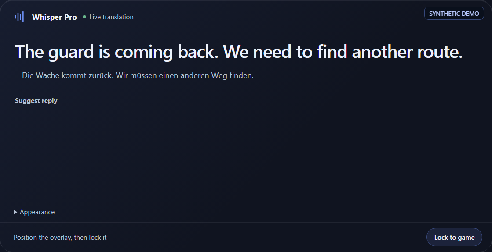
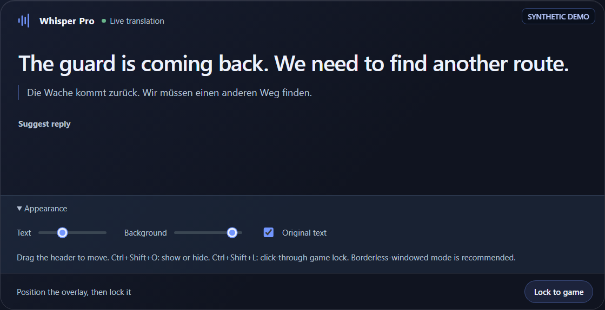

# Usage

Whisper Pro combines local speech recognition with optional cloud translation and reply generation. The application interface is currently primarily Turkish; this guide uses English feature names followed by the visible Turkish label where that helps identify a control.

## 1. Prepare the application

1. Start the desktop application with `npm start` or the root `başlat.bat` launcher.
2. Expand **Settings** (`Ayarlar`).
3. Choose an audio source:
   - **System audio** for calls, videos, streams, and games playing through Windows.
   - **Microphone** for speech reaching the selected input device.
4. Choose the expected spoken language. Automatic detection is convenient, but selecting a known language can improve stability.
5. Choose a Whisper model appropriate for the computer. Larger models can be more accurate but require more memory and processing time.
6. If translation is needed, choose the provider and target language. Configure credentials only in the local environment or settings flow described in [Installation](INSTALLATION.md).
7. Start listening and confirm that the status bar reports an active source and model.

The first use of a model may require a download. Do not close the application while that download is in progress.

## 2. Understand the live conversation view

Each finalized utterance appears in the conversation stream with its time, detected language, confidence, and optional speaker label. A muted partial preview can appear while somebody is still speaking; the final transcript replaces it when the utterance is complete.

Available line-level actions include:

- **Translate** (`Çevir`): translate only this transcript.
- **Suggest reply** (`Soru-Cevap` / `Cevap Öner`): generate replies using this line and recent context.
- **Edit text** (`Metni düzelt`): correct recognition errors before translation or AI use.
- Copy and reading controls where available.

The conversation and reply areas scroll independently so a long transcript remains readable while reply tools stay available.

## 3. Choose between automatic and manual translation

Continuous incoming translation is optional.

- Enable it when every new utterance should be translated automatically.
- Leave it disabled for a cleaner or lower-cost transcript, then press **Translate** below only the lines you need.

Manual translation is forced by an explicit user action and therefore works independently of the continuous-translation toggle. A failed translation does not remove the original transcript; check the configured provider, key, model, and network connection, then retry.

## 4. Generate and speak a reply

1. Set the language you want to answer in.
2. Press **Suggest reply** below the relevant incoming line.
3. Select the desired suggestion length: short, normal, or detailed.
4. Review each option:
   - the sentence to send or say in the target language;
   - its Turkish meaning;
   - a Turkish-friendly pronunciation line.
5. Open **Reading mode** (`Okuma modu`) to display one pronunciation at a large size.
6. Use **Listen** or **Listen slowly** to hear the native sentence through an installed Windows voice.

Keyboard shortcuts in the visible reply area:

- `1`–`4`: open the corresponding suggestion in Reading mode.
- `Esc`: close Reading mode.

Use **Save to phrases** (`Kalıplara kaydet`) for a response you expect to reuse. Use **Said** (`Söyledim`) after using a suggestion so subsequent AI responses can avoid repeating it. Pronunciation is a reading aid, not a phonetic guarantee; verify names and critical wording.

## 5. Write or say your own reply

Expand **Write or say your own reply** (`Kendi cevabını yaz veya söyle`) when none of the generated suggestions fits.

- Type a Turkish response and translate it into the selected reply language.
- Use the microphone push-to-talk path to capture your own short response and prepare its translated/read-aloud form.
- Use **Send now** (`Şimdi Gönder`) during incoming capture to finalize the audio collected so far without waiting for the normal silence boundary.

The application's global push-to-talk behavior is opt-in. Check the visible settings and shortcut status before relying on it in another application.

## 6. Use quick phrases and saved replies

**Quick phrases** (`Hızlı kalıplar`) are prepared for the selected target language and open immediately without an AI request. They include native text, Turkish meaning, and pronunciation.

Saved replies are stored locally in the application profile. You can search, open, listen to, or remove them. They are not restored by cloning the GitHub repository and should not be treated as a cloud backup.

## 7. Use Game Mode

Game Mode combines a compact always-on-top translation window with a temporary system-audio capture profile for quicker dialogue turns. It does not perform OCR, inject into the game, or start audio capture automatically.

### Start Game Mode

1. Press **Game Mode** (`Oyun modu`) in the main header. The button changes to show that the mode is active and the overlay opens.
2. Select **System audio**, enable the desired translation path, and start listening normally.
3. Move the overlay by dragging its header and resize it from the window edges.
4. In **Appearance** (`Görünüm`), adjust:
   - text size;
   - background opacity;
   - whether the original transcript is shown above the translation.
5. Press **Lock to game** (`Oyuna kilitle`) or `Ctrl+Shift+L`. In locked mode, mouse clicks pass through to the game and only the translated line remains visible.

### Game Mode shortcuts

| Shortcut | Action |
| --- | --- |
| `Ctrl+Shift+O` | Show or hide the overlay |
| `Ctrl+Shift+L` | Lock or unlock the overlay for click-through use |

Pressing the main **Game Mode** button again disables the temporary profile and closes the overlay. Merely hiding or closing the overlay does not necessarily disable the backend Game Mode profile; use the main button when you are finished.

The profile affects only system-audio capture. It keeps the normal model, VAD sensitivity, translation provider, microphone settings, and push-to-talk behavior. It uses a shorter adaptive silence target and a shorter continuous-audio segment limit, while preserving the user's normal settings for use after Game Mode is disabled.

Borderless-windowed mode is recommended. Exclusive fullscreen and anti-cheat systems can block ordinary desktop overlays, so visibility cannot be guaranteed in every game.

## 8. Identify speakers

Optional pyannote diarization attempts to separate speakers and lets you rename detected labels. It requires the optional Hugging Face setup described in the settings and may load additional components only when enabled.

Speaker labels are probabilistic. Short turns, interruptions, background audio, noise, and similar voices can cause speakers to be merged or split. Do not use these labels as identity evidence.

## 9. Search, correct, summarize, and ask questions

- Use the main search field for the current rendered conversation.
- Expand detailed search to query full retained history by text, date, or speaker.
- Correct a transcript before relying on its translation or AI context.
- Use **Create summary** (`Özet Al`) for a compact account of the conversation.
- Enter a question in **Ask about the conversation** (`Konuşma hakkında sor`) to query the retained context.

Summary and question features require a configured AI provider and may send transcript text to it. See [Privacy and data flow](PRIVACY.md).

## 10. Export or reset a conversation

Choose `TXT` for a readable text record or `SRT` for approximate subtitle timing, then press **Download** (`İndir`). Review SRT timing before using it as a finished subtitle file.

**Reset** (`Sıfırla`) clears the active conversation view and session state. Export anything you need first. Stop listening before changing devices or closing the application.

## Troubleshooting checklist

- No text: verify the selected device, Windows audio activity, capture mode, and model status.
- Translation fails: verify the chosen provider, key, target language, supported model, and connection.
- Reply suggestions fail: verify the response-provider configuration separately from transcription.
- Overlay is missing: use borderless-windowed mode, press `Ctrl+Shift+O`, and check the main Game Mode button.
- No spoken playback: install or select a compatible Windows voice for the target language.
- Slow CPU processing: choose a smaller Whisper model or disable live partial previews on constrained hardware.

For detailed recovery steps, see [Troubleshooting](TROUBLESHOOTING.md). For what leaves the computer, see [Privacy](PRIVACY.md).
