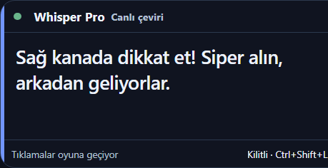

# Oyun üstü canlı çeviri kutusu

- Repo: https://github.com/dorukakindev/whisper-live; dal `main`.
- Başlangıç HEAD: `413c2a4761004b39c461402751acea732c1b7498`.
- Bitiş kod commit'i: `3684da2cb7c089020c5f5486f9c25b34b60e2b19`.
- Başlangıç çalışma ağacı temiz; fetch sonrası uzak fark 0/0. Proxifier kapalı tutuldu.

## Kullanım

1. Uygulamayı yeniden başlat. Ana pencerede Sistem sesi, doğru çıkış cihazı ve çeviriyi aç; model hazırken Başlat'a bas.
2. Ana başlıktaki **Oyun çevirisi** düğmesi veya **Ctrl+Shift+O** kutuyu açar. Menü ve tray üzerinden de açılabilir.
3. Başlıktan taşı, kenarlardan boyutlandır. Görünüm ve kullanım bölümünden yazı (18–36), zemin saydamlığı ve orijinal metin ayarlanır.
4. **Oyuna kilitle** / **Ctrl+Shift+L** fare tıklamalarını oyuna geçirir ve pencerenin odak almasını kapatır. Kilitli modda yalnız çeviri gösterilir. Aynı kısayol kilidi açar. Ana penceredeki Oyun çevirisi düğmesi mevcut pencereyi kilitsiz açarak ikinci kurtarma yolu sunar.
5. Ctrl+Shift+O göster/gizler. L kısayolu başka uygulamaya aitse kilitleme reddedilir; O kısayolu alınamazsa ana pencere/menü kullanılır.

Varsayılan 520×240, alt sınır 320×220. Dar kilitli kutuda yazı en çok 18 px; büyük/uzun çeviriler için pencere büyütülebilir. Konum ve boyut electron-store'da, görünüm localStorage'da saklanır. Monitör çıkarılmışsa pencere görünür alana alınır. Açılış oyundan odağı almayan showInactive kullanır. Kenarlıksız pencere modu önerilir; exclusive fullscreen/anti-cheat kullanan tüm oyunlar için görünürlük garantisi yoktur. Enjeksiyon veya DirectX hook eklenmedi.

## Dosyalar ve davranış

- `main.js`: üstte duran pencere, güvenli renderer kimliği/ana frame denetimli dar IPC, oyun kilidi, global kısayol, ekran dışı konum kurtarma. Kapanışta L kısayolu bırakılır.
- `preload.js`: yalnız overlayControl ve durum aboneliği köprüsü; nodeIntegration kapalı/contextIsolation açık.
- `templates/overlay.html`: çeviri öncelikli ortak tema, ayarlar, kilit göstergesi, hata/bekleme/bağlantı durumları. mic/PTT ayrılır; düzeltme sürümü ve eski HTTP/socket sonuçları korunur. Yeni kayıt/sıfırlama eski hydration sonucunu geçersiz kılar.
- `templates/index.html`, `static/cockpit.js`: ana ekrandan açma ve tarayıcı kullanımında masaüstü yönlendirmesi.
- `buyedektir.py`: sıfırlamada transcriptions_cleared olayı, overlay'in eski konuşmayı tutmaması için.
- `test_game_overlay.js`: pencere/konum/fare kilidi sözleşmesi. `test_game_overlay_native.js`: gerçek Electron pencere, preload IPC, üstte kalma/focusable ve kapanış kısayolu testi. Önce `test_cockpit_browser.js` fixture üretir.
- `test_cockpit_browser.js`: yeni overlay sistem/PTT ayrımı, eski çeviri reddi, hata görünümü, kilit/orijinal metin/sıfırlama ve küçük ekran görüntüleri. `test_new_report_frontend.js`: sürüm fixture'ı.
- `DESIGN.md`: yeni davranış sözleşmesi. `docs/images/game-overlay.png`: yalnız sentetik oyun cümlesiyle ekran görüntüsü, kişisel veri yok.

## Araştırma

- https://github.com/lmachens/skeleton — saydamlık, click-through ve üstte kalma yaklaşımları.
- https://github.com/MichShav/J2EOverlay — küçük çeviri overlay'i ve kenarlıksız mod önerisi; OCR odaklı olduğundan motor alınmadı.
- https://www.electronjs.org/docs/latest/api/browser-window — ignoreMouseEvents, focusable, showInactive ve alwaysOnTop resmi API.

Harici kod kopyalanmadı, yeni bağımlılık/lisans eklenmedi. Mevcut sistem sesinden transkripsiyon/çeviri hattı kullanılır; ekran OCR'ı veya yeni çeviri sağlayıcısı yok.

## Kontroller ve sınırlar

- 11 Node test dosyası (10 mevcut + test_game_overlay.js) geçti. main/preload ve iki HTML inline JS sözdizimi kontrolleri geçti.
- `electron.cmd test_cockpit_browser.js`: gerçek Chromium ve ekran görüntüleri geçti. Küçük kilitli boyutta görülen satır kesilmesi düzeltilip tekrar görüntülendi.
- `electron.cmd test_game_overlay_native.js`: gerçek Windows Electron penceresinde preload kilidi aç/kapat, üstte kalma ve kısayol temizliği geçti. Oyun içinde fiziksel fare/klavye testi yapılmadı.
- `python -m unittest test_live_enhancements test_audio_diagnostics`: 20 test geçti. py_compile/pyflakes temiz. `test_smoke.py`: 33/34; mevcut Torch c10.dll WinError 1114 konuşmacı testi engeli sürüyor.
- Premium strict audit: 0 hata/uyarı; yerel rapor artifacts içinde. Gerçek 5097 backend `/`, `/overlay`, tokenlı `/api/settings`: 200.
- Bundled Node 24.19.0 `build.js`: portable yenilendi, kaynak/paket taraması temiz, altı üretim dosyası bayt bazında eşleşti. `git diff --check` temiz.
- Gerçek oyundan ses, ücretli AI çevirisi, exclusive fullscreen ve anti-cheat uyumluluğu doğrulanmadı. Screenshot metinleri test verisidir. Yeni PC kurulumu ayrıca doğrulanmalıdır.

Kod commit'i hazır. Bu not, tasarım ve indeks ayrı belge commit'iyle push edilir; uzak HEAD son yanıtta doğrulanır. Paket `dist/Whisper-Pro-win32-x64/Whisper-Pro.exe` olarak yerelde yenilendi; dist Git'e eklenmez. Format sonrası son kod bu nottadır, önceki format rehberi geçerlidir. Proxifier yeniden açılmaz.
